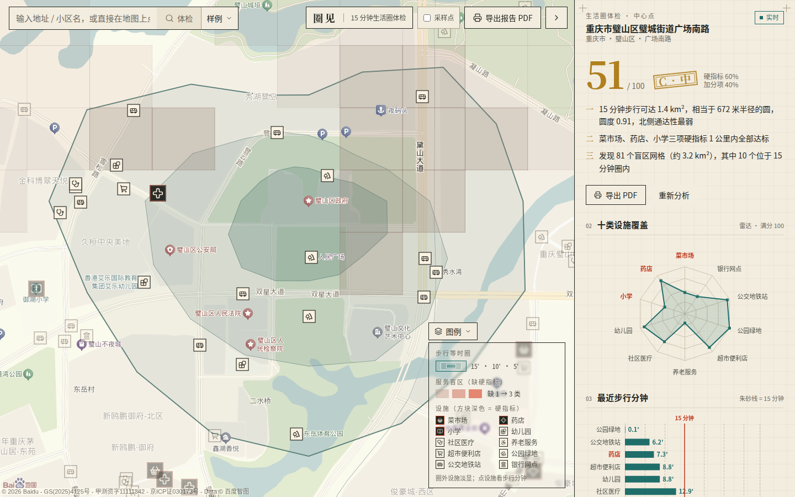
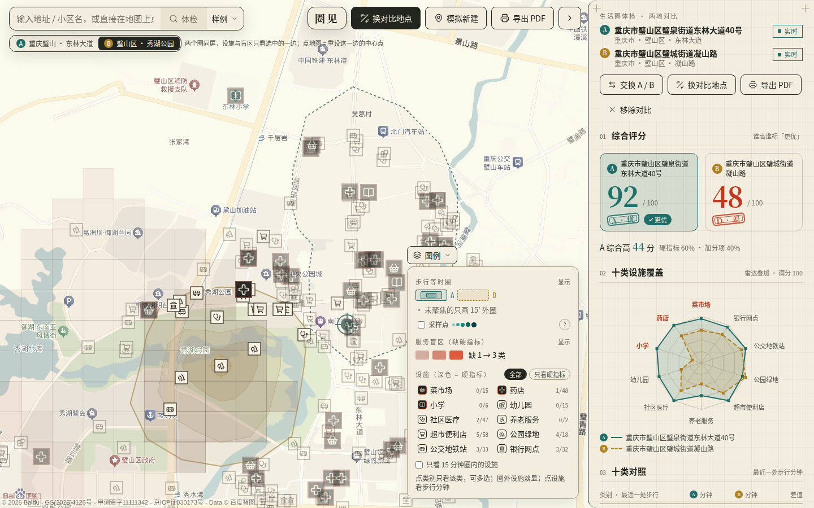
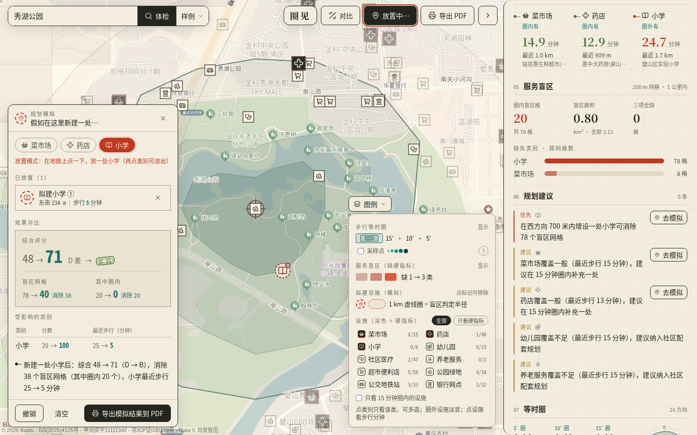
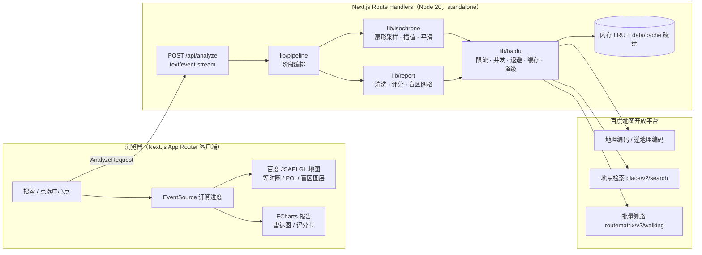

# 圈见 QuanJian

[](https://github.com/chunge-php/quanjian/actions/workflows/ci.yml)
[](LICENSE)
[](.nvmrc)
[](package.json)

> **QuanJian** is an open-source "15-minute living circle" health-check and planning assistant built on Baidu Maps open APIs. Pick any point on the map; it derives a real walking isochrone from sector sampling + batch route matrix (no raw road network required), audits nearby daily-life facilities (markets, pharmacies, primary schools, …), locates service blind spots on a 200 m grid, and streams a scored report with planning suggestions. Built for the 2026 Shanghai Open Source Software Application Innovation Competition (Baidu Maps enterprise track).

**一句话定位**：点一个地方，15 秒内告诉你这里的「15 分钟生活圈」缺什么、缺在哪、该往哪补。

参赛信息：2026 上海开源软件应用创新大赛（开源中国主办）· 开源 AI 工具赛道 · 百度地图企业赛题《基于地图开放能力的"15 分钟生活圈"智能体检与规划助手》。

---

## 功能亮点

| 能力            | 说明                                                                                                       |
| --------------- | ---------------------------------------------------------------------------------------------------------- |
| 真实步行等时圈  | 16 方向 × 7 半径扇形采样 → 批量算路 → 单调修正 + 线性插值，输出 5/10/15 分钟三环嵌套多边形                 |
| 民生设施体检    | 10 类设施（菜市场 / 药店 / 小学为硬指标），多关键词检索、uid 去重、名称黑白名单清洗、批量步行算路          |
| 服务盲区识别    | 200 m 网格扫描 1 km 内硬指标缺失，圈内盲区优先，给出严重度与建议补点方位                                   |
| 渐进式输出      | SSE 流式返回：等时圈先出，POI 随后，报告最后，用户不必盯着空白页等待                                       |
| 工程化 API 调用 | 令牌桶限流、并发窗口、指数退避、内存 + 磁盘两级缓存、四级降级链，`apiStats` 全程可观测                     |
| 可部署可测试    | Docker 一键、GitHub Actions CI、Vitest 单测、无 AK 时自动回退样例数据                                      |
| 两地对比        | A / B 双槽位串行分析，双圈同屏、聚焦切换，分数 / 雷达叠加 / 十类对照 / 硬指标 / 盲区自动出结论             |
| 模拟新建        | 「假如在这里新建一处菜市场 / 药店 / 小学」：地图上放置拟建设施，本地即时重算分数与盲区，前后对比可导出 PDF |



两地对比：东林大道（A，92 分）vs 秀湖公园（B，48 分），结论按类别分差自动生成。



模拟新建：在秀湖公园西侧放一处小学，综合 48 → 71（D → B），消除 38 个盲区网格。



---

## 技术架构



- 坐标系全程使用 **BD-09**（与百度 Web 服务 API / JSAPI GL 一致，不转换）。
- 服务端 AK 只存在于 Node 进程；浏览器只拿到带 Referer 白名单的浏览器端 AK。
- 类型契约集中在 [`lib/types.ts`](lib/types.ts)，设施类别定义在 [`lib/categories.ts`](lib/categories.ts)。

---

## 快速开始

### 路线 A：Docker 一键（推荐评委 / 体验者）

```bash
git clone https://github.com/chunge-php/quanjian.git
cd quanjian
cp .env.example .env          # 填入两个 AK；不填则使用内置样例数据
bash scripts/demo.sh          # Windows：scripts\demo.cmd
# 打开 http://localhost:3010
```

停止：`bash scripts/demo.sh down`。也可直接拉取镜像：

```bash
docker run -d --name quanjian -p 3010:3010 --env-file .env \
  -v "$(pwd)/data/cache:/app/data/cache" ghcr.io/chunge-php/quanjian:latest
```

> 镜像内不包含任何 AK。浏览器端 AK 在构建期内联，因此需要自定义浏览器端 AK 时请用 `docker compose up --build`（读取 `.env` 中的 `NEXT_PUBLIC_BAIDU_BROWSER_AK` 作为 build-arg）。

### 路线 B：本地开发

```bash
git clone https://github.com/chunge-php/quanjian.git
cd quanjian
bash scripts/setup.sh         # 检查 node>=20 / pnpm，生成 .env.local，pnpm install
# Windows：scripts\setup.cmd
# 编辑 .env.local 填入 AK
pnpm dev                      # http://localhost:3010
```

生产方式运行：`pnpm build && pnpm start`（standalone 输出在 `.next/standalone/`）。

---

## 环境变量

复制 [`.env.example`](.env.example) 为 `.env.local`（本地）或 `.env`（Docker）。**任何 `.env*` 文件都已在 `.gitignore` 中，请勿提交。**

| 变量                           | 必填 | 默认   | 说明                                                                                                                                                         |
| ------------------------------ | ---- | ------ | ------------------------------------------------------------------------------------------------------------------------------------------------------------ |
| `BAIDU_SERVER_AK`              | 是\* | —      | **服务端 AK**。用于地理编码、地点检索、批量算路。只在 Node 进程内读取，从不下发到浏览器、不出现在任何前端产物或日志中。                                      |
| `NEXT_PUBLIC_BAIDU_BROWSER_AK` | 是\* | —      | **浏览器端 AK**。仅用于 JSAPI GL 地图渲染，会内联进前端 JS（`NEXT_PUBLIC_` 前缀即公开）。必须在百度控制台配置 **Referer 白名单**，否则被盗用即计入你的配额。 |
| `BAIDU_MAX_CONCURRENCY`        | 否   | `3`    | 批量算路并发窗口。个人开发者配额下 3 已足够，调大不会更快，只会触发限流。                                                                                    |
| `BAIDU_QPS`                    | 否   | `20`   | 令牌桶每秒令牌数，须不高于你的 AK 配额。                                                                                                                     |
| `ALLOW_SAMPLE_FALLBACK`        | 否   | `true` | 无 AK 或 API 持续异常时是否回退到 `data/samples/` 内置样例。生产环境建议设为 `false` 以避免误导。                                                            |

\* 两个 AK 都为空时，应用以「样例模式」运行，页面顶部会明确提示，报告 `dataSource` 字段为 `sample`。

**脱敏原则**

- 服务端 AK 与浏览器端 AK 必须是**两个不同的应用**：服务端 AK 用「服务端」类型并配置 IP 白名单（或不限制，但仅放在服务器）；浏览器端 AK 用「浏览器端」类型并配置 Referer 白名单（如 `*.yourdomain.com/*`、本地开发加 `localhost:3010/*`）。
- 日志、错误信息、SSE 事件、`apiStats` 中均不包含 AK。提交 Issue 前请检查粘贴的 URL 是否带 `ak=` 参数。
- CI 构建使用占位 AK（见 [`.github/workflows/ci.yml`](.github/workflows/ci.yml)），不会调用真实接口。

---

## 百度地图 AK 申请步骤

1. 登录 [百度地图开放平台](https://lbsyun.baidu.com/) 并完成开发者认证（个人开发者即可）。
2. 控制台 → **应用管理 → 我的应用 → 创建应用**。
3. 创建 **服务端应用**：应用类型选「服务端」，启用「地理编码」「逆地理编码」「地点检索」「批量算路」；IP 白名单填服务器出口 IP（本地开发可填 `0.0.0.0/0`，上线前收紧）。得到的 AK 填入 `BAIDU_SERVER_AK`。
4. 创建 **浏览器端应用**：应用类型选「浏览器端」，Referer 白名单填 `localhost:3010/*` 与你的域名。得到的 AK 填入 `NEXT_PUBLIC_BAIDU_BROWSER_AK`。
5. 在「配额管理」确认批量算路的每日调用量与 QPS，按需下调 `BAIDU_QPS`。

---

## 使用说明

1. 首页输入地址（例：`重庆市璧山区璧城街道`）或直接在地图上点击选点。
2. 点击「开始体检」。右侧进度依次显示：地理编码 → 扇形采样 → 批量算路 → 等时圈 → 设施检索 → 设施算路 → 评分 → 盲区。
3. 等时圈会先渲染（5/10/15 分钟三环），随后 POI 逐类落图，最后报告卡片出现。
4. 报告包含：综合评分与评级、各类设施最近步行分钟、盲区网格（颜色深浅 = 严重度）、按优先级排序的规划建议、本次 API 调用统计。
5. 点击盲区网格可查看缺失类别与建议补点方位；点击 POI 可查看步行距离来源（真实算路 / 估算）。

---

## 算法简介

详细设计见 [`docs/技术设计文档.md`](docs/技术设计文档.md)。

**等时圈**：以中心点为原点，向 16 个方位角各铺 7 个半径（250 → 1800 m）的采样点，112 个 O-D 对交给百度批量算路取真实步行时长；每个方向上对步行时长做单调修正，再在相邻半径间线性插值出 5/10/15 分钟的可达半径；对 16 个顶点做圆周平滑，输出三环嵌套多边形。整个过程不需要底层路网数据，河流、铁路、封闭小区造成的阻隔会自然表现为该方向半径收缩。圆度 = 4πA / P²，越低说明阻隔越重。

**设施体检**：每类用多关键词检索，uid 去重，名称 / tag 黑白名单剔除误检（如「小学」检索命中的「小学生托管班」），直线预筛后再批量算路取步行分钟；按《社区生活圈规划技术指南》TD/T 1062-2021 建议服务半径打分。

**盲区**：在 1.5 km 见方范围铺 200 m 网格，每格检查 1 km 内是否有全部硬指标（菜市场 / 药店 / 小学），缺失数 / 硬指标数 = 严重度；圈内盲区优先，并计算距离最近已有设施的反方向作为建议补点方位。

---

## 目录结构

```
quanjian/
├── app/                 # Next.js App Router：页面与 /api 路由
│   └── api/             #   analyze（SSE）· health
├── components/          # 百度 JSAPI GL 地图、ECharts 报告等 UI 组件
├── lib/
│   ├── types.ts         # 全局类型契约（所有模块以此为准）
│   ├── categories.ts    # 10 类设施定义、检索词、标准服务半径
│   ├── baidu/           # API 客户端：限流 · 并发 · 退避 · 两级缓存 · 降级
│   ├── isochrone/       # 扇形采样 · 插值 · 平滑 · 几何工具
│   ├── report/          # POI 清洗 · 评分 · 盲区网格
│   └── pipeline/        # 阶段编排，产出 AnalyzeEvent 流
├── data/
│   ├── samples/         # 内置样例（无 AK 时回退）
│   └── cache/           # 磁盘缓存（gitignore，Docker 卷）
├── tests/               # Vitest 单元测试
├── scripts/             # setup / demo 一键脚本（sh + cmd）
├── docs/                # 技术设计 · 测试报告 · 演示脚本 · 开源治理
└── .github/             # CI · Docker 发布 · Issue/PR 模板 · Dependabot
```

---

## 测试与 CI

```bash
pnpm format:check   # Prettier
pnpm lint           # ESLint（next/core-web-vitals）
pnpm typecheck      # tsc --noEmit
pnpm test           # Vitest：几何、采样、插值、清洗、评分、限流器
pnpm build          # Next.js standalone
```

- [`ci.yml`](.github/workflows/ci.yml)：每次 push / PR 依次执行以上五步，pnpm 缓存加速。
- [`docker.yml`](.github/workflows/docker.yml)：推送 `v*.*.*` 标签时构建多阶段镜像并发布到 `ghcr.io/chunge-php/quanjian`。
- 真实数据对比测试见 [`docs/测试报告.md`](docs/测试报告.md)。

---

## 路线图 · 贡献 · 治理

- 长期规划：[ROADMAP.md](ROADMAP.md)
- 参与贡献：[CONTRIBUTING.md](CONTRIBUTING.md) · 行为准则 [CODE_OF_CONDUCT.md](CODE_OF_CONDUCT.md)
- 安全报告：[SECURITY.md](SECURITY.md)
- 治理与依赖许可证：[docs/开源治理.md](docs/开源治理.md)
- 变更记录：[CHANGELOG.md](CHANGELOG.md)

---

## 许可证

[MIT](LICENSE) © 2026 Ye Chun (chunge-php)

使用本项目调用百度地图服务时，须同时遵守 [百度地图开放平台服务条款](https://lbsyun.baidu.com/index.php?title=open/law)；本项目不缓存或再分发百度地图底图与 POI 原始数据以外的任何受限内容，API 缓存仅用于本地加速且带过期时间。

## 致谢

- [百度地图开放平台](https://lbsyun.baidu.com/) —— 提供地理编码、地点检索、批量算路与 JSAPI GL 能力及本赛题。
- [开源中国 OSCHINA](https://www.oschina.net/) —— 2026 上海开源软件应用创新大赛主办方。
- 自然资源部《社区生活圈规划技术指南》TD/T 1062-2021 —— 设施服务半径依据。
