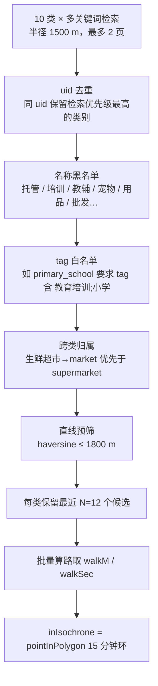
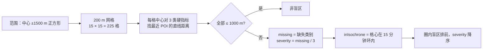
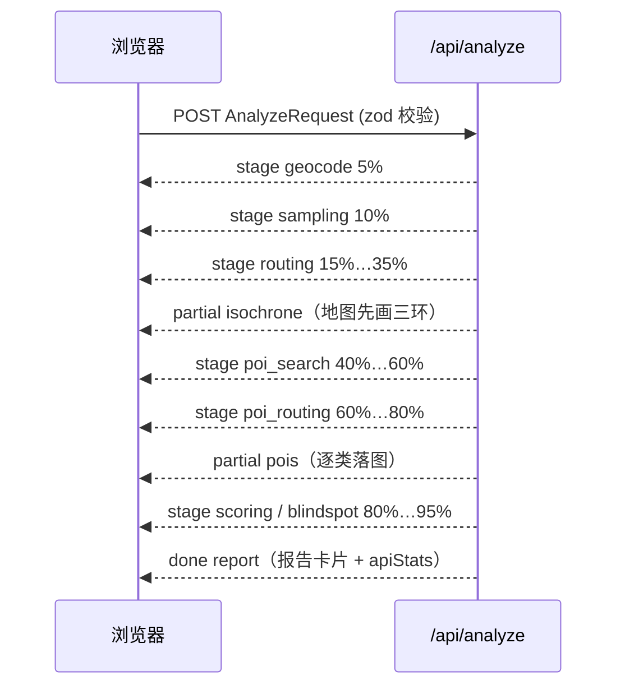

# 圈见 · 技术设计文档（下）：POI 清洗、盲区识别、评分、SSE 与错误处理

> **实现细节以代码为准。** 上篇见 [技术设计文档.md](技术设计文档.md)（API 调用策略、等时圈算法）。类别定义与标准服务半径见 `lib/categories.ts`。

## 1. 多源 POI 数据清洗策略

### 1.1 为什么需要清洗

百度地点检索按关键词模糊匹配，直接使用会出现：`小学` 命中「小学生托管班」「小学教辅书店」；`药店` 命中「宠物药店」；`菜市场` 与 `生鲜超市` 命中同一个 uid；「XX 超市」同时被 `supermarket` 与 `market` 抓到。评分若建立在这些噪声上，硬指标会被虚假满足，盲区判定失真。

### 1.2 流程



### 1.3 规则明细

| 步骤       | 规则                                                                                             | 输出字段      |
| ---------- | ------------------------------------------------------------------------------------------------ | ------------- | ---- | ---- | ---- | ---- | ------ | --------------------- |
| 多关键词   | `FacilityCategoryMeta.queries` 逐词检索（不用 `$` 拼接，避免百度按"或"返回混杂结果难以溯源）     | 原始列表      |
| uid 去重   | `Map<uid, Poi>`，冲突时按 `FACILITY_CATEGORIES` 数组顺序（硬指标在前）决定归属                   | `category`    |
| 名称黑名单 | 每类维护正则；命中即剔除。示例：`primary_school: /托管                                           | 培训          | 教辅 | 辅导 | 书店 | 文具 | 校服/` | 剔除计数进 `warnings` |
| tag 白名单 | `FacilityCategoryMeta.tags` 存在时，POI `detail_info.tag` 必须包含其一                           | —             |
| 跨类归属   | 名称含「生鲜」「农贸」→ 强制 `market`；含「社区卫生服务」→ 强制 `clinic`；含「地铁」→ `bus_stop` | `category`    |
| 直线预筛   | `straightM > 1800` 剔除（15 分钟等时圈最大半径），减少算路 O-D 对                                | `straightM`   |
| 候选上限   | 每类按直线距离取最近 12 个进入算路；其余保留但 `walkSource='estimate'`                           | `walkSource`  |
| 圈内判定   | 对 15 分钟环做射线法 `pointInPolygon`                                                            | `inIsochrone` |

数据量：10 类约 23 次检索，去重清洗后典型 60 ～ 120 个 POI，进入算路约 100 个 O-D 对（2 次 API 调用）。

## 2. 服务盲区识别算法

### 2.1 定义

盲区 = 在体检范围内、**1 km 直线范围内缺少至少一个硬指标类别**（菜市场 / 药店 / 小学）的位置。1 km 取自 TD/T 1062-2021 中 15 分钟生活圈对这三类设施的服务半径。

### 2.2 网格扫描



- 网格用 `offsetMeters(center, dx, dy)` 生成，避免经纬度直接加减在高纬度失真。
- 距离查询用直线而非算路：225 格 × 3 类若都算路需要 675 对（14 次调用），收益不大——盲区是宏观判断，直线足够；且已有 POI 的步行分钟能校准直线的乐观程度。
- 为什么 200 m：更细（100 m）网格数翻四倍但视觉上无差异；更粗（500 m）会漏掉小区级别的缺口。

### 2.3 建议补点方位

对每个盲区簇（相邻盲区格合并，4-连通）：

1. 取簇质心 `c`；
2. 对每个缺失类别，找该类**最近的已有 POI** `p`；
3. 建议方位 = 从 `p` 指向 `c` 的方位角 `bearingBetween(p, c)`，建议距离 = `max(0, dist(p, c) − 1000)`；
4. 文案：「在中心东北方向约 600 m 处（XX 路一带）增设药店，可覆盖 N 个盲区格」——地名来自逆地理编码簇质心。

覆盖收益按「新增一个点后消除的盲区格数」排序，作为 `suggestions[].priority` 的依据。

## 3. 评分模型

### 3.1 类别分（0 ～ 100）

以最近设施的步行分钟 `nearestWalkMin` 和该类标准服务半径对应的步行分钟 `stdMin = standardRadiusM / 1.2 / 60`（1000 m ≈ 14 min，500 m ≈ 7 min）：

| 条件                                     | 分数                         |
| ---------------------------------------- | ---------------------------- |
| `nearestWalkMin ≤ stdMin × 0.5`          | 100                          |
| `stdMin × 0.5 < nearestWalkMin ≤ stdMin` | 线性 100 → 70                |
| `stdMin < nearestWalkMin ≤ stdMin × 1.5` | 线性 70 → 40                 |
| `nearestWalkMin > stdMin × 1.5`          | 线性 40 → 0（20 分钟封底 0） |
| 无 POI                                   | 0                            |

数量加成：圈内数量 ≥ 2 时 +5，≥ 4 时 +10，上限 100。评级：A ≥ 85，B ≥ 70，C ≥ 50，D < 50。

### 3.2 综合分

```
overall = Σ(score_i × w_i) / Σ w_i
w = essential ? 2 : 1
```

硬指标任一为 D 时，综合评级最高 C（一票否决，对应赛题"缺失即盲区"的硬约束）。

### 3.3 结论与建议生成

- `headline`（≤ 3 条）：① 综合评级与等效半径；② 最弱硬指标；③ 圆度 < 0.7 时说明路网阻隔。
- `suggestions` 按优先级：`high` = 硬指标 D 级或圈内盲区簇；`medium` = 非硬指标 D 级、硬指标 C 级；`low` = 圆度、数量不足等改善项。
- 全部为模板文案 + 数据填充，不调用大模型，保证可复现与零额外成本。

## 4. SSE 渐进式输出

`POST /api/analyze` 返回 `text/event-stream`，事件类型见 `AnalyzeEvent`：



- 每个事件一行 `data: <json>\n\n`；15 s 无事件发送 `: ping` 注释保活，避免反代 60 s 空闲断开。
- `error.recoverable=true` 表示流水线继续（例如某类 POI 检索失败），前端只弹提示；`false` 表示终止。
- 客户端 `AbortController` 中止时服务端取消尚未发出的批次，已取得的结果写缓存不浪费。
- 为什么不用 WebSocket：单向、短连接、无需回压，SSE 在 Next.js Route Handler 中用 `ReadableStream` 即可实现，部署无额外要求。

## 5. 错误处理矩阵

| 场景                       | 检测                                 | 处理                                       | 用户可见                       | apiStats        |
| -------------------------- | ------------------------------------ | ------------------------------------------ | ------------------------------ | --------------- |
| 未配置服务端 AK            | 启动时读 env                         | `ALLOW_SAMPLE_FALLBACK` 决定样例或拒绝     | 顶部黄条「样例模式」           | —               |
| AK 无效 / IP 不在白名单    | `status` 240 / 210                   | 不重试，样例或 `error` 不可恢复            | 错误卡 + 文档链接              | —               |
| 配额超限 / 并发超限        | `status` 302 / 401、HTTP 429         | 指数退避 ≤ 3 次；仍失败则估算              | 进度条附注「限流中，重试 n/3」 | `rateLimited++` |
| 单批算路失败               | 非 0 status / 超时                   | 该批 destinations 用估算，其他批正常       | 该方向虚线                     | `degraded++`    |
| 采样点不可达（水域）       | `result[i].status ≠ 0`               | `walkSec=null`，方向截断                   | 无                             | —               |
| 某类 POI 检索失败          | 非 0 status                          | 该类 `countInIsochrone=0`，`warnings` 说明 | 报告该类标注「数据缺失」       | `degraded++`    |
| 地理编码无结果             | `result.location` 为空               | `error recoverable=false`                  | 「未找到该地址」               | —               |
| 地址在境外 / 坐标异常      | zod 范围校验（lng 73–135，lat 3–54） | 400                                        | 表单校验提示                   | —               |
| 缓存文件损坏               | JSON.parse 失败                      | 删除该文件，视为未命中                     | 无                             | —               |
| 磁盘缓存不可写（只读容器） | 写入异常                             | 仅用内存缓存，记一次 warn 日志             | 无                             | —               |
| 客户端断开                 | `request.signal.aborted`             | 停止后续批次，已获结果写缓存               | —                              | —               |
| 浏览器端 AK Referer 不匹配 | JSAPI 加载失败回调                   | 页面显示说明与白名单配置步骤               | 地图区域错误提示               | —               |

## 6. 可观测性

`HealthReport.apiStats` 字段在报告底部展示，字段含义见 `lib/types.ts` 的 `ApiStats`。典型无缓存一次分析：`geocode 1–2`、`placeSearch ≈ 23`、`routeMatrix ≈ 5`、`routeMatrixPairs ≈ 210`、`elapsedMs 4000–8000`。`GET /api/health` 返回 `{ ok, version, sampleMode, cache: { l1, l2Files } }` 供 Docker HEALTHCHECK 与运维检查。
