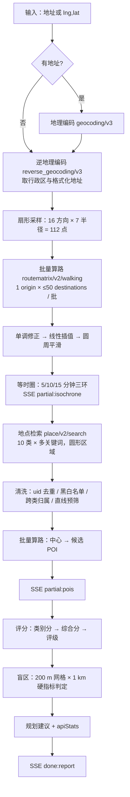
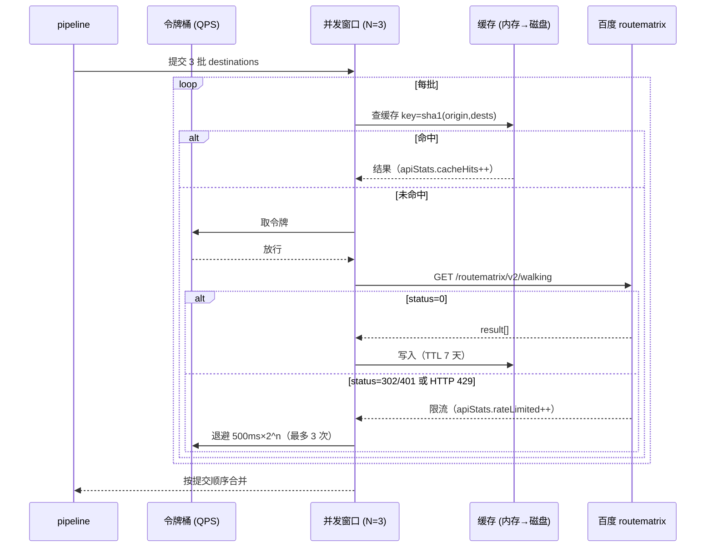
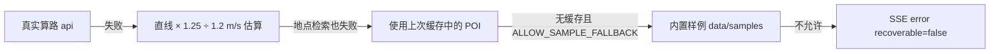

# 圈见 · 技术设计文档（上）：API 调用策略与等时圈算法

> **实现细节以代码为准。** 本文描述设计意图与关键参数；数值以 `lib/` 中的常量为准（如 `lib/isochrone/sampling.ts` 的 `DEFAULT_BEARINGS` / `DEFAULT_RADII_M`），代码未落地处按本文设计实现。
>
> 下篇见 [技术设计文档-数据与评分.md](技术设计文档-数据与评分.md)：POI 清洗、盲区识别、评分模型、SSE 输出、错误处理矩阵。

## 0. 赛题交付要求对照

| 赛题要求                         | 对应章节               | 对应代码                            |
| -------------------------------- | ---------------------- | ----------------------------------- |
| 地图 API 调用策略                | 本文 §2                | `lib/baidu/`                        |
| 等时圈生成算法设计（无底层路网） | 本文 §3                | `lib/isochrone/`                    |
| 多源 POI 数据清洗策略            | 下篇 §1                | `lib/report/clean.ts`（或同等模块） |
| 服务盲区识别算法                 | 下篇 §2                | `lib/report/blindspot.ts`           |
| 评分与规划建议                   | 下篇 §3                | `lib/report/score.ts`               |
| 交互与渐进式输出                 | 下篇 §4                | `lib/pipeline/`、`app/api/analyze/` |
| 错误处理 / 限流降级              | 本文 §2.4–2.6、下篇 §5 | `lib/baidu/`                        |

## 1. 总体流程



阶段名与 `AnalyzeStage` 一一对应：`geocode → sampling → routing → isochrone → poi_search → poi_routing → scoring → blindspot → done`。

## 2. 地图 API 调用策略

### 2.1 使用的接口

| 接口             | 端点                                                         | 用途                                                                 | 关键参数                                                                                                   |
| ---------------- | ------------------------------------------------------------ | -------------------------------------------------------------------- | ---------------------------------------------------------------------------------------------------------- |
| 地理编码         | `GET https://api.map.baidu.com/geocoding/v3/`                | 地址 → 坐标                                                          | `address` `output=json` `ret_coordtype=bd09ll`                                                             |
| 逆地理编码       | `GET https://api.map.baidu.com/reverse_geocoding/v3/`        | 坐标 → 行政区、格式化地址                                            | `location=lat,lng` `coordtype=bd09ll` `extensions_town=true`                                               |
| 地点检索（圆形） | `GET https://api.map.baidu.com/place/v2/search`              | 按类别找设施                                                         | `query` `location=lat,lng` `radius` `radius_limit=true` `page_size=20` `page_num` `scope=2` `coord_type=3` |
| 批量算路（步行） | `GET https://api.map.baidu.com/routematrix/v2/walking`       | 采样点 / POI 的真实步行距离与时长                                    | `origins=lat,lng` `destinations=lat,lng\|lat,lng…` `coord_type=bd09ll`                                     |
| 国内天气查询     | `GET https://api.map.baidu.com/weather/v1/`                  | 中心点实况 + 3 天预报 → 步行舒适度提示（旁路，失败静默、不计入统计） | `location=lng,lat`（实测支持，注意经度在前）或 `district_id=adcode` `data_type=all`                        |
| JSAPI GL         | `https://api.map.baidu.com/api?type=webgl&v=1.0&ak=浏览器AK` | 前端底图与图层                                                       | 仅浏览器端 AK                                                                                              |

所有 Web 服务请求只在 Node 侧发起，附加 `ak=BAIDU_SERVER_AK`。前端从不直接调用 Web 服务 API。

### 2.2 坐标顺序这个坑

项目内部统一 `{ lng, lat }`（与 GeoJSON、JSAPI `new BMapGL.Point(lng, lat)` 一致），但百度 **Web 服务 API 的 `location` / `origins` / `destinations` 参数是 `lat,lng`**，且 `routematrix` 的返回 `origin_location` / `destination_location` 是 `{ lat, lng }` 对象。`lib/baidu` 提供唯一的序列化函数 `fmtLatLng(p: LngLat): string` 负责翻转，其他模块禁止手写拼接。这是本项目单测覆盖的第一条用例。

### 2.3 分批与并发

批量算路每次最多 **1 个 origin × 50 个 destinations**（个人开发者配额）。112 个采样点切成 3 批（50 + 50 + 12）；POI 算路按类别聚合后同样按 50 切片。



- **并发窗口** `BAIDU_MAX_CONCURRENCY`（默认 3）：同一时刻在途请求数上限。批次间不串行等待，但保持提交顺序合并结果，保证 `samples[i]` 与 `destinations[i]` 对齐。
- **QPS 令牌桶** `BAIDU_QPS`（默认 20）：每秒补满，取不到令牌时等待而非丢弃。所有接口共享一个桶，避免地点检索把算路的配额吃光。
- 地点检索 10 类 × 平均 2.3 个关键词 ≈ 23 次请求，同样走并发窗口；每类按 `essential` 优先级排队，硬指标先出。

### 2.4 退避

| 触发条件                                                       | 动作                                                       |
| -------------------------------------------------------------- | ---------------------------------------------------------- |
| HTTP 429 / 5xx，或百度 `status` ∈ {302 配额超限, 401 并发超限} | 指数退避 500 ms → 1 s → 2 s，最多 3 次；期间令牌桶暂停发放 |
| `status` = 2（参数错误）                                       | 不重试，记录并降级                                         |
| `status` = 240 / 210（AK 无效 / IP 白名单）                    | 不重试，整条流水线进入样例模式（若允许）                   |
| 网络超时（默认 8 s）                                           | 重试 1 次，再失败降级                                      |

### 2.5 两级缓存

| 层  | 实现                            | 键                         | TTL  | 目的                    |
| --- | ------------------------------- | -------------------------- | ---- | ----------------------- |
| L1  | 进程内 LRU（上限 500 条）       | 接口名 + 参数规范化后 sha1 | 1 h  | 同一会话重复分析零开销  |
| L2  | `data/cache/<接口>/<hash>.json` | 同上                       | 7 天 | 重启不丢，Docker 卷挂载 |

- 参数规范化：坐标四舍五入到 5 位小数（≈1 m），关键词按字典序排序，避免等价请求产生不同键。
- 写缓存只在 `status=0` 时进行；降级估算结果不写缓存，避免"缓存了一个错误"。
- `AnalyzeRequest.noCache=true` 时跳过读取但仍写入。

### 2.6 降级链



- 每个采样点 / POI 记录 `source: 'api' | 'estimate'`，前端用虚线区分估算值。
- `HealthReport.dataSource`：全部 api → `live`；混有 estimate → `mixed`；样例 → `sample`。`warnings[]` 逐条说明降级原因。
- `apiStats.degraded` 计数，用于评估当前配额是否够用。

## 3. 等时圈生成算法

### 3.1 为什么不需要底层路网

传统等时圈（如 OSRM `isochrone`、Valhalla）需要完整路网图做 Dijkstra。百度批量算路已经在其路网上算好了任意两点的真实步行时长，我们只需要**在合适的位置提问**：从中心出发向各方向走，走多远会用掉 15 分钟。路网中的河流、铁路、封闭小区、立交等阻隔会直接体现为该方向的步行时长陡增，等时圈在该方向自然收缩。代价是 112 次 O-D 计算（3 次 API 调用），而不是下载几十兆的路网数据。

### 3.2 扇形采样

- 方向：`DEFAULT_BEARINGS = 16`，方位角 0°, 22.5°, …, 337.5°。
- 半径：`DEFAULT_RADII_M = [250, 500, 750, 1000, 1250, 1500, 1800]`。1.2 m/s 步速下覆盖约 3.5 ～ 25 分钟；1500 后加密到 1800 是为通畅方向（15 分钟远超 1080 m 直线圆）留插值余地。
- 采样点由大圆公式 `destinationPoint(center, bearing, radius)` 生成（`lib/isochrone/geo.ts`）。
- 顺序：先方向后半径，同一方向的 7 个点在数组中连续，便于按方向做单调修正。

### 3.3 单调修正

同一方向上，步行时长理论上应随半径单调不减，但路网会导致 1000 m 处比 750 m 处更近（例如 750 m 落在河对岸、1000 m 落在桥头）。处理：

1. 对每个方向的 7 个 `walkSec` 做**累积最大值**（`t[i] = max(t[i], t[i-1])`），保证单调；
2. `walkSec = null`（不可达 / 水域）视为 `+∞`，其后的点全部截断；
3. 若一个方向所有点都为 null，用相邻两方向的可达半径均值兜底，并计入 `warnings`。

### 3.4 线性插值

对目标时长 T（300 / 600 / 900 s），在该方向找到相邻的 `t[i] ≤ T < t[i+1]`，可达半径：

```
r(T) = r[i] + (T − t[i]) / (t[i+1] − t[i]) × (r[i+1] − r[i])
```

- T 小于 `t[0]`：`r = r[0] × T / t[0]`（从原点线性外推）。
- T 大于 `t[6]`：钳制到 1800 m，不外推。

得到 16 个方向 × 3 个时长的可达半径，即 `reachRadiusByBearing`（15 分钟）及内环。

### 3.5 圆周平滑与三环嵌套

- 对 16 个顶点做一次环形三点加权平滑 `r'[k] = 0.25 r[k−1] + 0.5 r[k] + 0.25 r[k+1]`，消除单个方向的采样噪声，同时不抹平真正的阻隔（权重 0.5 保留主体）。
- 嵌套约束：`r5 ≤ r10 ≤ r15`，逐方向取 `min`，保证三环不交叉。
- 多边形：按方位角顺序连接顶点，首尾闭合，输出 GeoJSON `Polygon`（`[lng, lat]`）。
- 面积：`polygonAreaKm2`（球面近似）；等效半径 `sqrt(A/π)`。

### 3.6 圆度指标

```
circularity = 4π × A / P²        ∈ (0, 1]
```

正圆为 1；等时圈被河流切掉一半时约 0.6 ～ 0.7。报告用它解释"这里的 15 分钟圈为什么比别处小"，并作为规划建议的触发条件之一（圆度 < 0.7 建议增加过街 / 过河通道）。

### 3.7 基线对比

赛题要求验证"真实步行圈 vs 直线圆"的差异。基线取 **1.2 m/s × 900 s = 1080 m 的直线圆**（面积 3.66 km²），测试报告中对比等时圈面积占比、各方向收缩率与人工步行导航抽样。见 [测试报告-模板.md](测试报告-模板.md)。

### 3.8 复杂度与配额

| 项目               | 数值                          |
| ------------------ | ----------------------------- |
| O-D 对             | 16 × 7 = 112                  |
| API 调用           | 3 次（50/50/12）              |
| 单次分析等时圈耗时 | 约 1 ～ 2 s（并发 3，无缓存） |
| 命中缓存           | < 50 ms                       |

方向数可通过 `AnalyzeRequest.bearings` 调到 8 或 32：8 方向仅 2 次调用但形状粗糙；32 方向 224 对 5 次调用，适合出报告。

## 4. 对比与模拟

### 4.1 两地对比

- A / B 两个槽位共用一条 `useAnalyze` 分析流（`lib/ui/useSlots.ts`），天然**串行**：同一时刻只有一条 SSE，不会把令牌桶打爆；运行中的槽位实时取流里的中间结果，完成后固化进槽位。
- 对比视图（`lib/ui/compare.ts`）只读两份 `HealthReport` 做纯函数对照：分差、按类别赢家、硬指标缺失、等时圈面积比，结论文案按分差阈值自动生成，不再调任何接口。
- 地图双圈同屏：未聚焦的一边只画 15 分钟外圈，设施 / 盲区只画聚焦一侧；切聚焦不重新分析，只换渲染数据源。

### 4.2 模拟新建（假如在这里新建一处 X）

- 拟建设施只是一个 `Poi`（`uid` 以 `virtual:` 开头），`applyVirtualFacilities(report, virtuals)`（`lib/ui/simulate.ts`）把它并入原报告后**在浏览器本地**重跑 `scoreCategories / detectBlindSpots / buildOverall`，~1 ms，幂等、不改入参。
- 服务端只在每次放置时被调一次 `/api/walk`（一对点算路，失败回直线估算），其余全部本地重算；报告一换（重新体检 / 切换聚焦）拟建列表自动清空。
- 导出 PDF 走「打印覆盖」：抽屉临时换成模拟后的报告并 `window.print()`，`afterprint` 恢复原报告，不新增打印模板。
